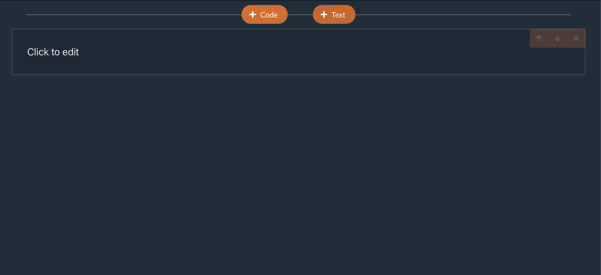
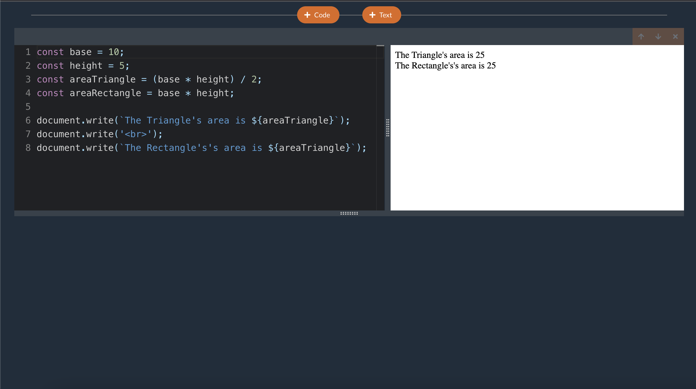
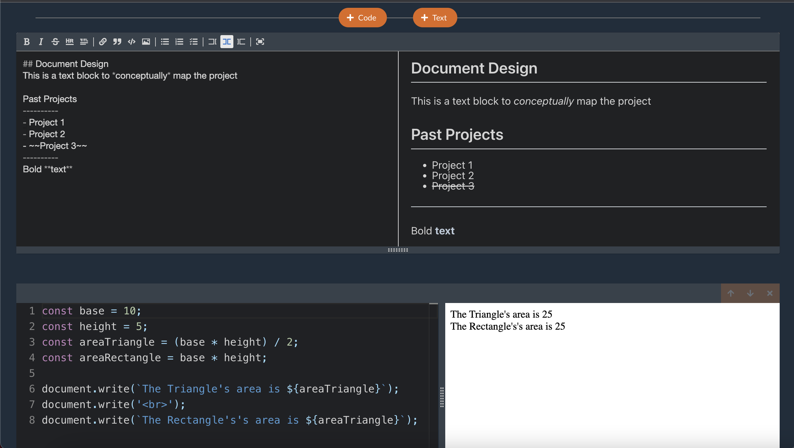
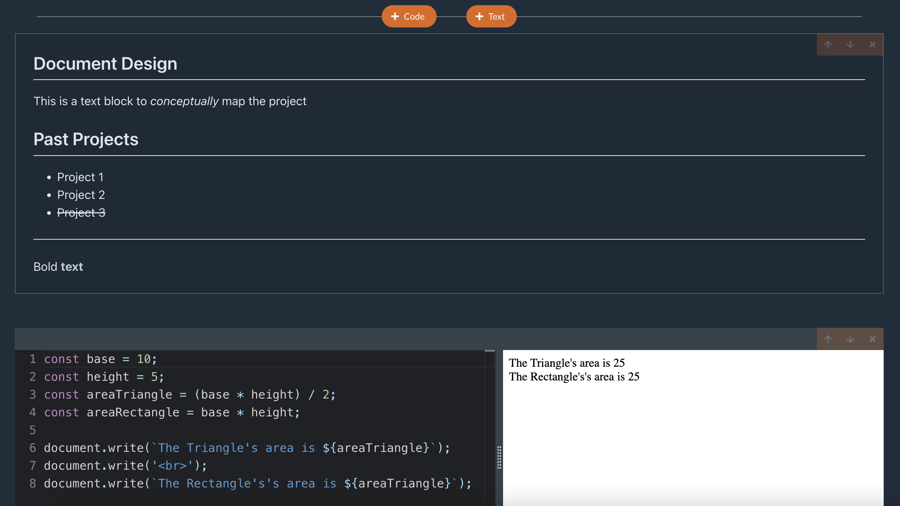
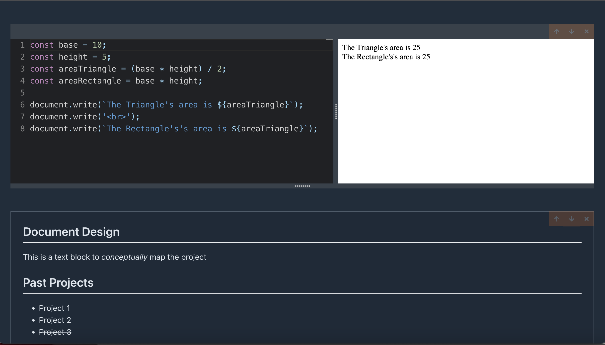

# Venus Notebook - Interactive Text Editor
An intuitive text and code editor notebook application that allows you to create text cards and write Javascript code in the browser!

This project uses Lerna to manage 3 Typescript packages that include a custom CLI, local API and a local client developed. The project is developed using Node.js, 
React.js, Redux, Redux-Thunk

Empty Screen (no text, no code)

Code Cell (write Javascript code and view it compile and run in realtime in the browser)

Text Cell (a fully featured rich text editor to create dynamic and expressive textfiles)

Display Text Cell (no editing, complete view)

Switch cell positions

